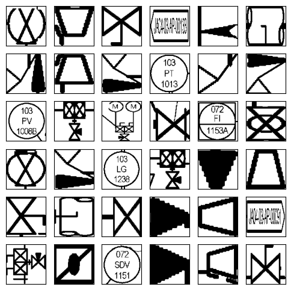
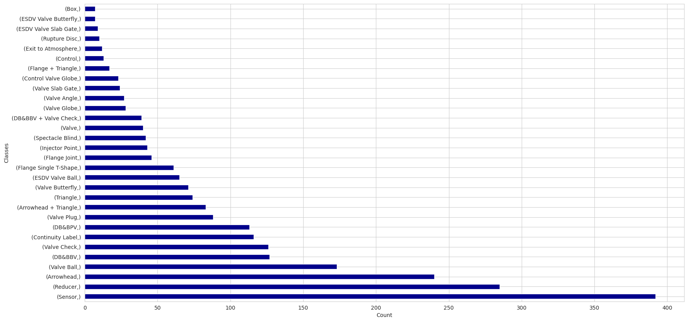

# Process Equipment Classification using CNN

## Dataset

The dataset consists of 2432 instances of process equipment symbols used in P&IDs. After preprocessing and splitting the dataset, here is a summary of the dataset:

| #Classes | #Train Images | #Validation Images | #Test Images |
| :------: | :------: | :------: | :------: |
| 30 | 1728 | 192 | 480 |

### Sample Dataset
Here are sample images of some process equipment symbols present in the dataset:

### Class Distribution
The following graph shows the number of images for each class of process equipment in the dataset (after preprocessing):

## Results

## Citation

> E. Elyan, C.G. Moreno, and P. Johnston, “Symbols in Engineering Drawings (SiED): An Imbalanced Dataset Benchmarked by Convolutional Neural Networks,” In 2020 International Joint Conference of the 21st EANN (Engineering Applications of Neural Networks), EANN 2020. Proceedings of the International Neural Networks Society, vol 2. Springer, Cham, DOI [10.1007/978-3-030-48791-1_16]
> (https://doi.org/10.1007/978-3-030-48791-1_16)
